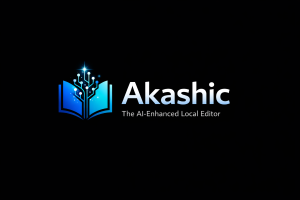

# Akashic

<div align="center">

</div>
A better Notepad with AI that runs on your own machine.

## Why I Built This

My friend’s Notepad crashed, which got me thinking about building a Notepad alternative that is safe and secure.

I also got tired of copying text into ChatGPT, receiving a response, and then copying it back. The back and forth workflow is annoying. I wanted something simple where the AI is readily available when needed, without sending my data anywhere and locally.

So I built this. It’s a solid Notepad alternative with local AI that respects your privacy.
## Why Local LLMs (Ollama)

I chose Ollama instead of OpenAI or Claude primarily because local LLMs offer:


**Privacy** - Your text stays on your computer. Config files, drafts, whatever you're writing never leaves your machine.

**No API keys or subscriptions** - Once it's set up, it just works. No monthly fees, no rate limits, no account bans.

**Works offline** - have bad internet? The AI still works.

**Pick your model** - Use a small 3B model for quick rewrites or a 70B model for complex tasks. Your hardware, your choice.

## Features

**Core Editing**
- Multiple tabs with unsaved change indicators
- Standard file operations (New, Open, Save, Save As)
- **Export as PDF** - Direct PDF export with save dialog (Ctrl+Shift+E)
- Find and Replace with regex support
- Go to Line (Ctrl+G)
- Word wrap toggle (responsive - text wraps based on window width)
- Zoom in/out/reset (Ctrl++, Ctrl+-, Ctrl+0)
- Fullscreen mode (F11) - not implemented yet


**AI Integration**
- Sidebar with Ollama integration
- Chat history with persistent storage
- Create, rename, delete, and search past chats
- Context-aware conversations (AI remembers previous messages)
- Quick actions: Explain code, Rewrite, Summarize, Fix grammar

**Interface**
- Clean menu bar (File, Edit, View, AI, Help)
- Right-click context menu
- Status bar showing file info, encoding, line endings, cursor position, zoom level
- Dark/Light mode toggle
- Toast notifications
- Keyboard shortcuts dialog

**Performance**
- Opens in under a second
- Uses less than 60 MB RAM at idle
- Native app feel without Electron bloat

## The Stack

**Go + Wails**

Go for the backend fast, compiles to a single binary, great cross-platform support. Wails lets me write the UI in HTML/CSS/JS while keeping native performance.

Why not Electron? Electron bundles an entire Chromium browser. That's why those apps are bloated and slow. Wails uses the system's native web renderer (WebView2 on Windows, WebKit on macOS). Smaller footprint, faster startup, actually feels like a native app.

Frontend is plain JavaScript - no React, no complex build steps. Keeps it simple.

## Getting Started

You'll need Go and Node.js installed, plus Ollama if you want the AI features.

```
wails dev
```

To build:
```
wails build
```

## The Name

Akashic refers to the Akashic Records - supposed to be a compendium of all universal knowledge. Yeah, it might sound big and dramatic… but I intentionally like that bold concept.

## License

MIT
